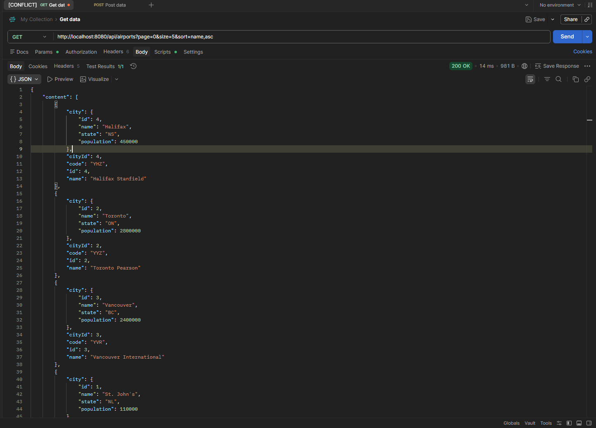

# Project Overview

This is a SpringBoot REST API with a separate Java CLI application that connects to the API over HTTP. The API manages airport data including cities, airports, passengers, and aircraft, and the CLI application answers four questions using GET requests.

## How to Run the Project

### API
- Run: AirportApiApplication.java
- URL: http://localhost:8080

### CLI Application
- Make sure the API is running first
- Run App.java in the CLI project

# Self Reflection
In this sprint I learned a lot about how Postman works and how it is used to properly test API endpoints by sending requests, adding query parameters, and checking responses. i also learned about pagination in SpringBoot and how page size, page number, and sorting actually change what data gets returned. Overall it helped me understand how APIs manage large amounts of data and how important Postman is for testing everything properly.

### Challenges
One challenge i had was using Postman correctly because i kept getting errors like 400 Bad Request when the URL or query parameters were not set up properly. I also had to figure out how pagination changes the response format and how to fix issues when the request wasn’t structured correctly.

# Sprint Reflection Questions

## Q1. Which two endpoints did you add pagination to, and why did those make sense to paginate?

I added pagination to: 

- `/api/airports`
- `/api/passengers`

I picked these two because in real life both the airports and passengers are datasets that get very big as airports are all over the world and passenger records scale over time. and using this without pagination could affect performance as the database grows bigger.

---

## Q2. Postman Request Using Pagination and Sorting

```text
http://localhost:8080/api/airports?page=0&size=5&sort=name,asc
```

This shows the first 5 airports sorted in ascending order by name.



---

## Q3. What does the Pageable parameter do in your code?

```java
@GetMapping
public Page<Airport> getAllAirports(Pageable pageable) {
   return airportRepository.findAll(pageable);
}
```
Pageable allows SpringBoot to automatically use pagination and sorting using their query parameters. it tells the repo what set of data to get from the database instead of showing it all.

---

## Q4. Difference between Page<T> and List<T>

- `List<T>` simply returns all records from the database without any additional information, and is better for smaller datasets where pagination is not required.

- `Page<T>` returns a subset of the data along with pagination metadata, such as: total pages and page size, and is used when working with large datasets because it improves performance and is more efficient. 